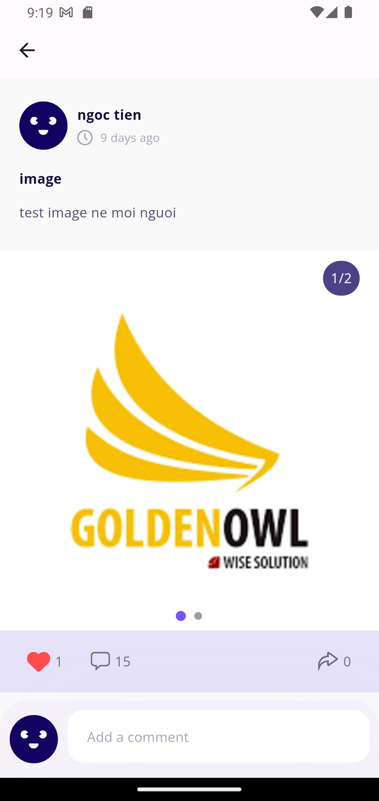

<div align="center">

  
  
  <h1>Jobspot</h1>
  
  <p>
    This is an application for posting, applying, and finding jobs between employers and candidates similar to the Linkedin App.
  </p>
  
  
<!-- Badges -->
<p>
  <a href="https://github.com/dustin-goldenowl/jobspot/graphs/contributors">
    
  </a>
  <a href="">
    
  </a>
  <a href="https://github.com/dustin-goldenowl/jobspot/network/members">
    
  </a>
  <a href="https://github.com/dustin-goldenowl/jobspot/stargazers">
    
  </a>
  <a href="https://github.com/dustin-goldenowl/jobspot/issues/">
    
  </a>
  <a href="https://github.com/dustin-goldenowl/jobspot/blob/master/LICENSE">
    
  </a>
</p>
   
<h4>
    <a href="https://github.com/dustin-goldenowl/jobspot/">View Demo</a>
  <span> · </span>
    <a href="https://github.com/dustin-goldenowl/jobspot">Documentation</a>
  <span> · </span>
    <a href="https://github.com/dustin-goldenowl/jobspot/issues/">Report Bug</a>
  <span> · </span>
    <a href="https://github.com/dustin-goldenowl/jobspot/issues/">Request Feature</a>
  </h4>
</div>

<br />

<!-- Table of Contents -->
# :notebook_with_decorative_cover: Table of Contents

- [About the Project](#star2-about-the-project)
  * [Screenshots](#camera-screenshots)
  * [Tech Stack](#space_invader-tech-stack)
  * [Features](#dart-features)
  * [Color Reference](#art-color-reference)
  * [Environment Variables](#key-environment-variables)
- [Getting Started](#toolbox-getting-started)
  * [Prerequisites](#bangbang-prerequisites)
  * [Installation](#gear-installation)
  * [Running Tests](#test_tube-running-tests)
  * [Run Locally](#running-run-locally)
  * [Deployment](#triangular_flag_on_post-deployment)
- [Directory Structure](#eyes-directory-structure)
- [Architecture Diagram](#chart-architecture-diagram)
- [Contributing](#wave-contributing)
- [FAQ](#grey_question-faq)
- [License](#warning-license)
- [Contact](#handshake-contact)
- [Acknowledgements](#gem-acknowledgements)

<!-- About the Project -->
## :star2: About the Project <a name="star2-about-the-project"></a>


<!-- Screenshots -->
### :camera: Screenshots <a name="camera-screenshots"></a>

| On Boarding  | Sign in | Sign up |
| --- | --- | --- |
|  |  |  |

| Connection  | Add Post | Edit Post |
| --- | --- | --- |
|  |  |  |

| Home  | Add Job | View Job |
| --- | --- | --- |
|  |  |  |

| Apply Job  | Apply Job | Apply Job |
| --- | --- | --- |
|  |  |  |

| View Post  | Save Job | Applicant Profile |
| --- | --- | --- |
|  |  |  |

| Setting  | Change Password | View Applicant Profile |
| --- | --- | --- |
|  |  |  |

| Search Job  | Filter Screen | Home for Business |
| --- | --- | --- |
|  |  |  |

| View Resumse Apply | Home for Admin | Test IQ |
| --- | --- | --- |
|  |  |  |

<!-- TechStack -->
### :space_invader: Tech Stack <a name="space_invader-tech-stack"></a>

<details>
  <summary>Mobile</summary>
  <ul>
    <li><a href="https://dart.dev/">Dart</a></li>
    <li><a href="https://flutter.dev/">Flutter</a></li>
  </ul>
</details>

<details>
  <summary>Serverless</summary>
  <ul>
    <li><a href="https://console.firebase.google.com/">Firebase</a></li>
  </ul>
</details>

<details>
  <summary>Server</summary>
  <ul>
    <li><a href="https://readthedocs.org/projects/flask/">Flask</a></li>
  </ul>
</details>

<details>
  <summary>Chat GPT API</summary>
  <ul>
    <li><a href="https://chat.openai.com/">Chat GPT API</a></li>
  </ul>
</details>

<details>
<summary>Database</summary>
  <ul>
    <li><a href="https://console.firebase.google.com/">Firebase FireStore</a></li>
  </ul>
</details>

<details>
<summary>DevOps</summary>
  <ul>
    <li><a href="https://www.gtihub.com/">Github</a></li>
    <li><a href="https://www.gtihub.com/">Github Action</a></li>
    <li><a href="https://fastlane.tools/">Fastlane</a></li>
    <li><a href="https://firebase.google.com/docs/crashlytics/">Firebase Crashlytics</a></li>
  </ul>
</details>

<!-- Features -->
### :dart: Features

- Sign In, Sign Up
- Manage business account registration
- Account management
- Manage recruitment posts
- Manage applications
- Article management
- Manage your favorite job categories
- Manage followers
- Job seeking
- Manage notifications
- Multi language
- Summary PDF
- Test IQ

<!-- Color Reference -->
### :art: Color Reference

| Color             | Hex                                                                |
| ----------------- | ------------------------------------------------------------------ |
| Primary Color |  #130160 |
| Secondary Color |  #D6CDFE |
| Accent Color |  #FF9228 |
| Text Color |  #150B3D |


<!-- Env Variables -->
### :key: Environment Variables

Coming soon

<!-- To run this project, you will need to add the following environment variables to your .env file

`API_KEY`

`ANOTHER_API_KEY` -->

<!-- Getting Started -->
## 	:toolbox: Getting Started

<!-- Prerequisites -->
### :bangbang: Prerequisites

This project uses Fastlane to auto deploy Firebase Distribution. You need to install Fastlane for this project. You need to install the ruby environment before installing Fastlane. Download and install [here](https://rubygems.org)

After installation is complete, run the command below to install Fastlane

```bash
 gem install fastlane
```

<!-- Installation -->
### :gear: Installation

Install all package in project

```bash
  flutter pub get
```
   
<!-- Running Tests -->
### :test_tube: Running Tests

To run tests, run the following command

```bash
  flutter test test/widget_test.dart
```

<!-- Run Locally -->
### :running: Run Locally

Clone the project

```bash
  git clone https://github.com/dustin-goldenowl/jobspot.git
```

Go to the project directory

```bash
  cd jobspot
```

Install dependencies

```bash
  flutter pub get
```

Set up Multiple Language

```bash
  flutter gen-l10n
```

Start the project

```bash
  flutter run
```


<!-- Deployment -->
### :triangular_flag_on_post: Deployment

To deploy this project to Firebase Distribution

```bash
  fastlane deploy_firebase_distribution version_name: version_name version_code: version_code
```

To deploy this project to CH Play

```bash
  fastlane deploy_ch_play version_name: version_name version_code: version_code
```

<!-- Directory structure -->
## :eyes: Directory Structure

```bash
jobspot
├───android
├───assets
│   ├───fonts
│   └───images
├───ios
├───lib
│   ├───l10n
│   └───src
│       ├───core
│       │   ├───bloc
│       │   ├───common
│       │   │   └───widgets
│       │   │       └───image_widget
│       │   │           ├───cubit
│       │   │           └───widget
│       │   ├───config
│       │   │   ├───localization
│       │   │   │   └───cubit
│       │   │   └───router
│       │   ├───constants
│       │   ├───enum
│       │   ├───extension
│       │   ├───function
│       │   ├───resources
│       │   ├───service
│       │   │   └───api
│       │   └───utils
│       ├───data
│       │   ├───entities
│       │   └───models
│       └───presentations
│           ├───add_appreciation
│           │   ├───cubit
│           │   ├───data
│           │   │   ├───models
│           │   │   └───repositories
│           │   ├───domain
│           │   │   ├───entities
│           │   │   ├───repositories
│           │   │   ├───router
│           │   │   └───use_cases
│           │   ├───screen
│           │   └───widgets
│           ├───add_education
│           ├───add_job
│           ├───add_language
│           ├───add_post
│           ├───add_resume
│           ├───add_skill
│           ├───add_work_experience
│           ├───applicant_profile
│           ├───apply_job
│           ├───check_email
│           ├───company_profile
│           ├───connection
│           ├───edit_applicant_profile
│           ├───edit_company_profile
│           ├───filter
│           ├───follow
│           ├───forgot_password
│           ├───home_admin
│           ├───home_applicant
│           ├───home_company
│           ├───job_description
│           ├───job_position
│           ├───location
│           ├───main
│           ├───notification
│           ├───on_boarding
│           ├───register_google
│           ├───save_job
│           ├───search_job
│           ├───search_language
│           ├───setting
│           ├───sign_in
│           ├───sign_up
│           ├───test_iq
│           ├───update_password
│           ├───verify_business
│           ├───verify_email
│           ├───verify_success
│           ├───view_applicant_profile
│           ├───view_company_profile
│           ├───view_job
│           ├───view_job_applicant
│           ├───view_pdf
│           ├───view_post
│           └───view_test_iq
├───linux
├───macos
├───screenshots
├───test
├───web
└───windows
```

<!-- Architecture Diagram -->
## :chart: Architecture Diagram

<a href="https://edrawcloudpublicus.s3.amazonaws.com/viewer/self/4383336/share/2023-11-10/1699584802/main.svg">
  
</a>

<!-- Contributing -->
## :wave: Contributing

<a href="https://github.com/dustin-goldenowl/jobspot/graphs/contributors">
  
</a>


Contributions are always welcome!

<!-- FAQ -->
## :grey_question: FAQ

Coming soon

<!-- - Question 1

  + Answer 1

- Question 2

  + Answer 2 -->


<!-- License -->
## :warning: License

Distributed under the no License. See ```LICENSE``` for more information.


<!-- Contact -->
## :handshake: Contact

Walter Tran - [@ngoctien.TNT](https://www.facebook.com/ngoctien.TNT/) - walter.tran.goldenowl@gmail.com

Project Link: [https://github.com/dustin-goldenowl/jobspot](https://github.com/dustin-goldenowl/jobspot)


<!-- Acknowledgments -->
## :gem: Acknowledgements
In Jobspot project, I used some useful resources and libraries to aid the development process.

 - [Desgin Figma](https://www.figma.com/file/2sMOWSroKFDsthE6Nn10ov/Job-Finder-Ui-App-Kit-(Community)?type=design&node-id=0%3A1&mode=design&t=yOVRg0VfUB2TVE5I-1)
 - [Firebase and related packages](https://firebase.google.com/)
 - [Flutter Bloc](https://pub.dev/packages/flutter_bloc)
 - [Auto Route](https://pub.dev/packages/auto_route)
 - [GetIt](https://pub.dev/packages/get_it)
 - [Flutter SVG](https://pub.dev/packages/flutter_svg)
 - [Shared Preferences](https://pub.dev/packages/shared_preferences)
